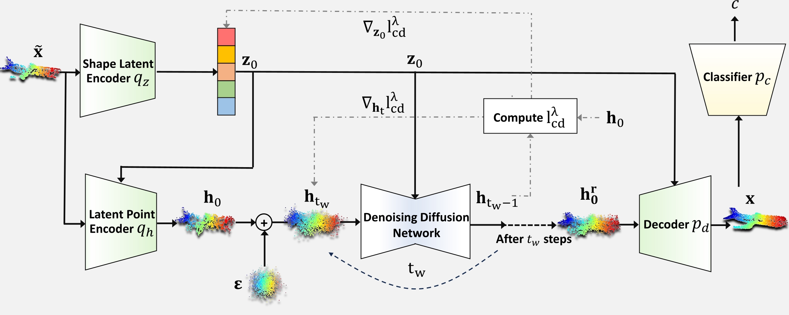

# 3DD-TTA
**Official PyTorch Implementation of the Paper "[Test-Time Adaptation of 3D Point Clouds via Denoising Diffusion Models]([Paper Link](https://openaccess.thecvf.com/content/WACV2025/html/Dastmalchi_Test-Time_Adaptation_of_3D_Point_Clouds_via_Denoising_Diffusion_Models_WACV_2025_paper.html))**

**Test-time adaptation (TTA)** of 3D point clouds is essential for addressing discrepancies between training and testing samples, particularly in corrupted point clouds like those from LiDAR data. Adapting models online to distribution shifts is crucial, as training for every variation is impractical. Existing methods often fine-tune models using self-supervised learning or pseudo-labeling, which can result in forgetting source domain knowledge.

We propose a training-free, online 3D TTA method called **3DD-TTA** (3D Denoising Diffusion Test-Time Adaptation), which adapts input point clouds using a diffusion strategy while keeping the source model unchanged. A Variational Autoencoder (VAE) encodes corrupted point clouds into latent spaces, followed by a denoising diffusion process. 

<p align="center">
  
</p>




## Key Features:
- **No fine-tuning required**: Keeps the source model intact.
- **Diffusion strategy**: Updates the corrupted latent points for alignment with the source domain.
- **Strong performance**: Achieves state-of-the-art results on ShapeNet, ModelNet40, and ScanObjectNN.


## Install:
```
# Create a new Conda environment named "3dd_tta_env" with Python 3.8
conda create --name 3dd_tta_env python=3.8
conda activate 3dd_tta_env

# Install PyTorch, torchvision, and torchaudio with CUDA 12.1 support
pip3 install torch torchvision torchaudio --index-url https://download.pytorch.org/whl/cu121

# Install all dependencies from requirements.txt
pip install -r requirements.txt

# Compile and install the Earth Mover's Distance (EMD) extension (used for point cloud comparison)
cd ./extensions/emd
python setup.py install --user
cd ../..

# Install the PointNet++ operations library (required for point cloud processing)
cd Pointnet2_PyTorch/pointnet2_ops_lib
pip install .
cd ../..

# Install KNN_CUDA (GPU-accelerated k-nearest neighbor functionality)
pip install --upgrade https://github.com/unlimblue/KNN_CUDA/releases/download/0.2/KNN_CUDA-0.2-py3-none-any.whl

# Install OpenAI's CLIP model (used for vision-language tasks)
pip install git+https://github.com/openai/CLIP.git 

# Build and package the project
python build_pkg.py
```

## Data Preparation

Our code supports three datasets: [ModelNet40](https://arxiv.org/abs/1406.5670), [ShapeNetCore](https://arxiv.org/abs/1512.03012), and [ScanObjectNN](https://arxiv.org/abs/1908.04616).
To prepare the data, please follow the **instructions** in the [preparation guide](./data/readme.md).

## Obtaining Pre-trained Source Models
You can download the source model (PointMAE) pretrained on Modelnet40, ShapeNet, and ScanObjectNN from [here](https://drive.google.com/drive/folders/1MTH8WpOqfAIiZ0DZV9p-tSKiDgQ_Id5A?usp=sharing). Put the PointMAE checkpoints inside `pointnet_ckpts` folder. To download the pretrained diffusion model you can use the following [link](https://huggingface.co/xiaohui2022/lion_ckpt/blob/main/unconditional/all55/checkpoints/epoch_10999_iters_2100999.pt). Put the diffusion checkpoints inside `lion_ckpts` folder.


## Qualitative Evaluation of 3dd_tta Model
To evaluate the model qualitatively, use the following command:
```
python demo_3dd_tta.py --diff_ckpt=./lion_ckpts/epoch_10999_iters_2100999.pt --denoising_step=35 --dataset_root=./data/modelnet40_c --corruption=background --sample_id=11
```

- Change the `corruption` argument to the OOD type you desire.
- For **background noise**, choose higher denoising steps (e.g., `35`) using the `denoising_step` argument.
- For other corruption types, use lower denoising steps like `5` or `10`.

This code will:
1. Read the sample determined by the `sample_id` and corrupted by the specified `corruption` type.
2. Adapt it back to the source domain.

The output will automatically be saved in the `./outputs/qualitative` folder.


## Quantitative Evaluation of 3dd_tta Model
To evaluate the model quantitatively, use the following command:
```
python main_3dd_tta.py --batch_size=32 --pointmae_ckpt=./pointnet_ckpts/modelnet_jt.pth --diff_ckpt=./lion_ckpts/epoch_10999_iters_2100999.pt --dataset_name=modelnet-c --dataset_root=./data/modelnet40_c
```
### Quantitative Evaluation Instructions

- Use the `--batch_size` argument to modify the batch size according to your requirements.
- Use the `--dataset_name` argument to select the dataset. Options include:
  - `modelnet-c`
  - `shapenet-c`
  - `scanobjectnn-c`
- Ensure the `--dataset_root` argument is updated to the appropriate root directory of the selected dataset.
- The script will automatically evaluate the model across all corruption types and generate a report. The results will be saved in: `./outputs/quantitative`

## Results:
Our method demonstrates superior generalization across multiple datasets, including ShapeNet, ModelNet40 and ScanObjectNN.

## Classification accuracies on ShapeNet-c


| Methods                  | uni  | gauss | back  | impu  | ups   | rbf   | rbf-i | den-d | den-i | shear | rot   | cut   | dist  | occ   | lidar | Mean  |
|--------------------------|------|-------|-------|-------|-------|-------|-------|-------|-------|-------|-------|-------|-------|-------|-------|-------|
| Point-MAE (src)          | 72.5 | 66.4  | 15.0  | 60.6  | 72.8  | 72.6  | 73.4  | 85.2  | 85.8  | 74.1  | 42.8  | _84.3_ | 71.7  | 8.4   | 4.3   | 59.3  |
| DUA                      | 76.1 | 70.1  | 14.3  | 60.9  | 76.2  | 71.6  | 72.9  | 80.0  | 83.8  | _77.1_ | **57.5** | 75.0  | 72.1  | 11.9  | 12.1  | 60.8  |
| TTT-Rot                  | 74.6 | 72.4  | _23.1_ | 59.9  | 74.9  | 73.8  | _75.0_ | 81.4  | 82.0  | 69.2  | 49.1  | 79.9  | 72.7  | _14.0_ | 12.0  | 60.9  |
| SHOT                     | 44.8 | 42.5  | 12.1  | 37.6  | 45.0  | 43.7  | 44.2  | 48.4  | 49.4  | 45.0  | 32.6  | 46.3  | 39.1  | 6.2   | 5.9   | 36.2  |
| T3A                      | 70.0 | 60.5  | 6.5   | 40.7  | 67.8  | 67.2  | 68.5  | 79.5  | 79.9  | 72.7  | 42.9  | 79.1  | 66.8  | 7.7   | 5.6   | 54.4  |
| TENT                     | 44.5 | 42.9  | 12.4  | 38.0  | 44.6  | 43.3  | 44.3  | 48.7  | 49.4  | 45.7  | 34.8  | 48.6  | 43.0  | 10.0  | 10.9  | 37.4  |
| MATE-S                   | _77.8_ | _74.7_ | 4.3   | _66.2_ | _78.6_ | _76.3_ | **75.3** | _86.1_ | _86.6_ | **79.2** | _56.1_ | _84.1_ | _76.1_ | 12.3  | _13.1_ | _63.1_ |
| 3DD-TTA (ours)           | **81.6** | **80.7** | **77.6** | **77.2** | **85.4** | **76.5** | **75.3** | **86.5** | **88.2** | 76.3  | 50.4  | **85.4** | **76.5** | **14.9** | **14.2** | **69.8** |


## Classification accuracies on ModelNet40-c


| Methods                | uni   | gauss | back  | impu  | ups   | rbf   | rbf-i | den-d | den-i | shear | rot   | cut   | dist  | occ   | lidar | Mean  |
|------------------------|-------|-------|-------|-------|-------|-------|-------|-------|-------|-------|-------|-------|-------|-------|-------|-------|
| Point-MAE (src)        | 62.4  | 57.0  | 32.0  | 58.8  | 72.1  | 61.4  | 64.2  | 75.1  | 80.8  | 67.6  | 31.3  | 70.4  | 64.8  | 36.2  | 29.1  | 57.6  |
| DUA                    | 65.0  | 58.5  | 14.7  | 48.5  | 68.8  | 62.8  | 63.2  | 62.1  | 66.2  | 68.8  | **46.2** | 53.8  | 64.7  | **41.2** | _36.5_ | 54.7  |
| TTT-Rot                | 61.3  | 58.3  | _34.5_ | 48.9  | 66.7  | 63.6  | 63.9  | 59.8  | 68.6  | 55.2  | 27.3  | 54.6  | 64.0  | 40.0  | 29.1  | 53.0  |
| SHOT                   | 29.6  | 28.2  | 9.8   | 25.4  | 32.7  | 30.3  | 30.1  | 30.9  | 31.2  | 32.1  | 22.8  | 27.3  | 29.4  | 20.8  | 18.6  | 26.6  |
| T3A                    | 64.1  | 62.3  | 33.4  | 65.0  | 75.4  | 63.2  | 66.7  | 57.4  | 63.0  | **72.7** | 32.8  | 54.4  | _67.7_ | 39.1  | 18.3  | 55.7  |
| TENT                   | 29.2  | 28.7  | 10.1  | 25.1  | 33.1  | 30.3  | 29.1  | 30.4  | 31.5  | 31.8  | 22.7  | 27.0  | 28.6  | 20.7  | 19.0  | 26.5  |
| MATE-S                 | _75.0_ | _71.1_ | 27.5  | _67.5_ | _78.7_ | **69.5** | **72.0** | **79.1** | _84.5_ | **75.4** | _44.4_ | _73.6_ | **72.9** | 39.7  | 34.2  | _64.3_ |
| 3DD-TTA (ours)         | **77.5** | **79.1** | **49.9** | **80.3** | **81.8** | _63.8_ | _66.9_ | **78.5** | **84.7** | 63.7  | 33.4  | **74.7** | 65.2  | _39.9_ | **42.2** | **66.1** |


@inproceedings{DBLP:conf/wacv/DastmalchiACRR25,
  author       = {Hamidreza Dastmalchi and
                  Aijun An and
                  Ali Cheraghian and
                  Shafin Rahman and
                  Sameera Ramasinghe},
  title        = {Test-Time Adaptation of 3D Point Clouds via Denoising Diffusion Models},
  booktitle    = {{IEEE/CVF} Winter Conference on Applications of Computer Vision, {WACV}
                  2025, Tucson, AZ, USA, February 26 - March 6, 2025},
  pages        = {1566--1576},
  publisher    = {{IEEE}},
  year         = {2025},
  url          = {https://doi.org/10.1109/WACV61041.2025.00160},
  doi          = {10.1109/WACV61041.2025.00160}
}
